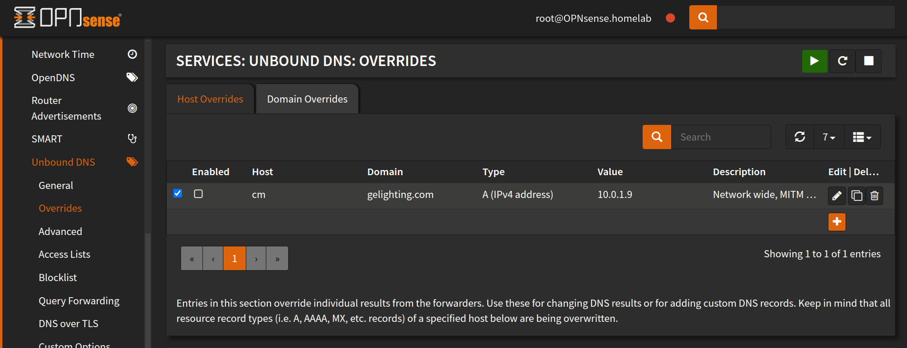
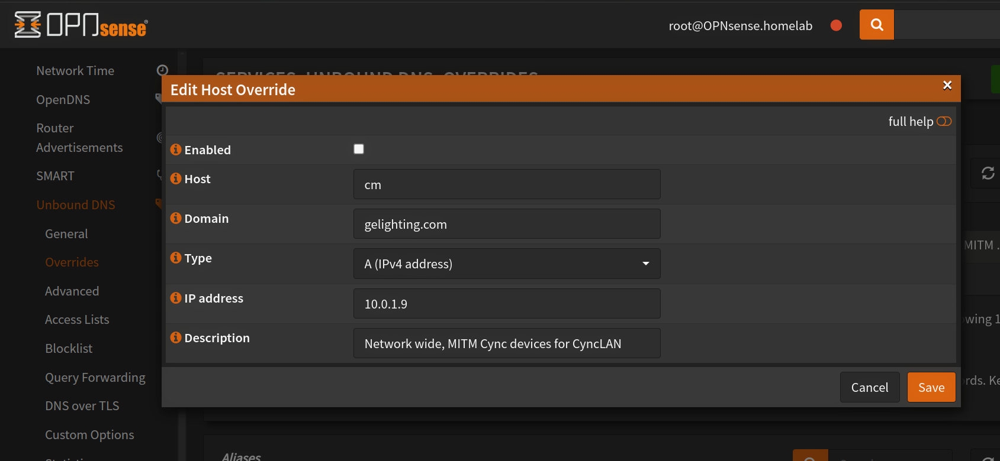
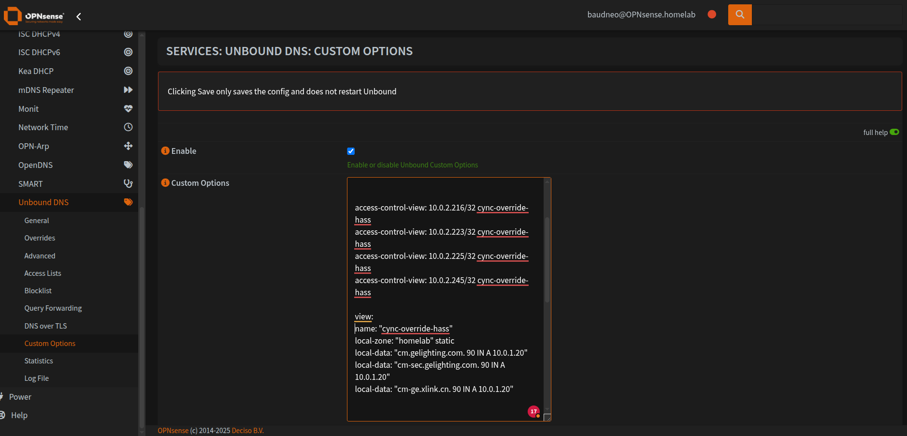
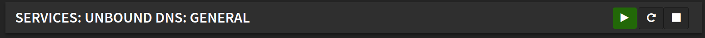
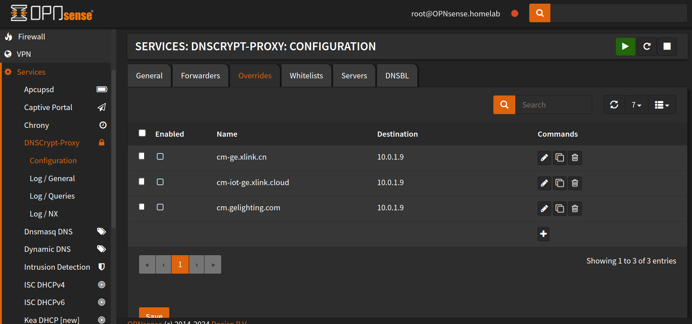
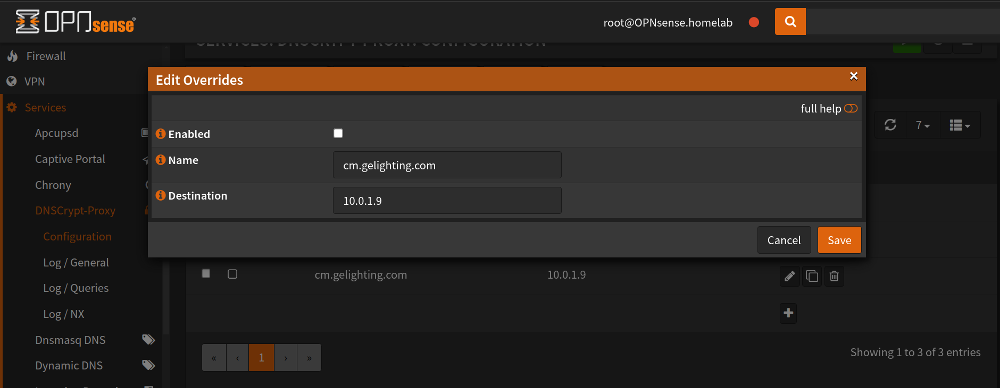
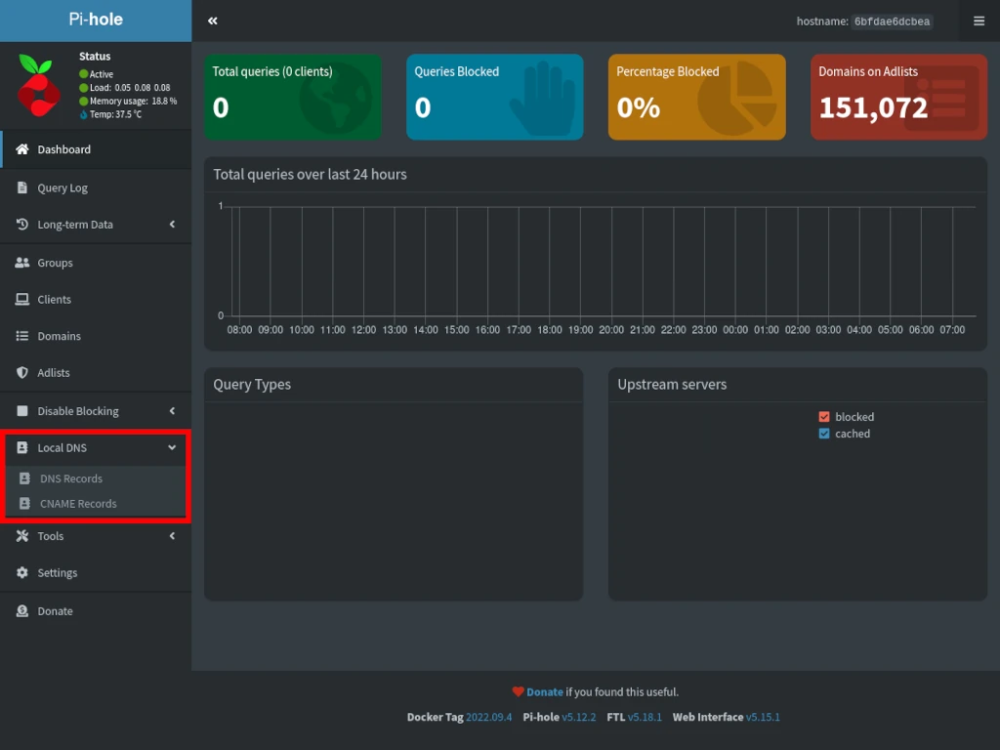
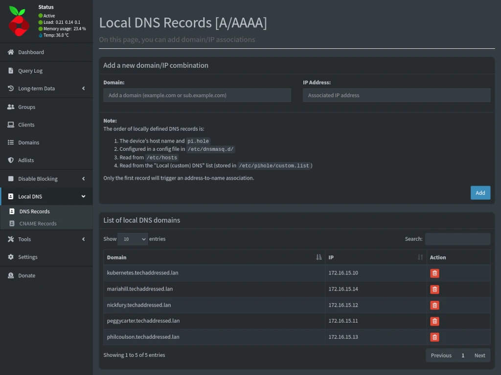

# Firmware differences

Check your DNS logs and search for `xlink.cn`, if you see DNS requests 
then you have some older devices. If you don't see any devices for `xlink.cn` search for `cm.gelighting.com`, 
if you see devices, that's newer firmware (or the Cync app). You may need to redirect both if you have a mix of newer and older firmware.

You need to override the cloud server domain to a local IP on your network. This server masquerades as the cloud TCP server.

Older firmware:
 - `cm-ge.xlink.cn`

Newer firmware:
 - `cm.gelighting.com`
 - `cm-sec.gelighting.com`


# OPNsense
There are a few different methods using OPNsense depending on your setup. Unbound allows for fine-tuned per 
requesting device IP, DNS redirection.

## Unbound DNS
To perform domain level DNS redirection (all devices that request `cm.gelighting.com` / `cm-sec.gelighting.com` will be redirected to ip: 10.0.1.9)

- Go to `Services`>`Unbound DNS`>`Overrides`.

- Create a new override for `cm.gelighting.com`, `cm-sec.gelighting.com` or `cm-ge.xlink.cn` and point it to your local server.

- Click Save.
- Power cycle cync devices.

### Selective DNS routing
**Selective DNS routing means, only certain devies will have their DNS redirected, the rest of your network will not have their DNS redirected for those specific domains**

You can use `views` to selectively route DNS requests based on the requesting device.

- First disable domain level redirection if you have already configured it. (all devices requesting a domain get redirected)
- Go to `Services`>`Unbound DNS`>`Custom Options`.

- Enter the data, click Save, go back to `Services`>`Unbound DNS`>`General` and restart unbound by clicking the button beside the green arrow.

- Power cycle cync devices.

The following example will match the above screenshot to reroute DNS requests for `cm.gelighting.com`, `cm-sec.gelighting.com` 
and `cm-ge.xlink.cn` to local IP `10.0.1.20` (this is where your Home Assistant server should be running) 
**only for requesting device IPs** `10.0.2.216`, `10.0.2.223`, `10.0.2.225`, and `10.0.2.245` (These should be Cync WiFi devices).


>[!WARNING]
> NOTICE the trailing `.` after `cm.gelighting.com.` in `local-data:`.
> 
> `local-zone` is your DNS domain (.local, .lan, .whatever). Notice there is no leading `.` in `local-zone`!!.

```
server:
access-control-view: 10.0.2.216/32 cync-override-hass
access-control-view: 10.0.2.223/32 cync-override-hass
access-control-view: 10.0.2.225/32 cync-override-hass
access-control-view: 10.0.2.245/32 cync-override-hass

view:
name: "cync-override-hass"
local-zone: "homelab" static
local-data: "cm.gelighting.com. 90 IN A 10.0.1.20"
local-data: "cm-sec.gelighting.com. 90 IN A 10.0.1.20"
local-data: "cm-ge.xlink.cn. 90 IN A 10.0.1.20"
```

>[!TIP]
> Don't redirect your phone app. Let it talk to the Cync cloud so you can add new devices, the phone app 
> should use bluetooth for local control anyway. The only time you will want to redirect the phone app is if you are 
> debugging communication between the phone app and the cloud using socat (or other programs similar to socat). 

>[!TIP]
> If you have a decent (6+) amount of Cync WiFi devices, after you get things working correctly,
> only DNS redirect Cync WiFi devices that are mostly always on, like plugs, mains powered switches / always on bulbs.
> I have 30+ Cync devices and only have 5 always on devices connected to my `cync-lan` server.

# DNSCryptProxy
As far as I know, you can only override a domain network wide, not selectively by device.

- Go to `Services`>`DNSCryptProxy`>`Configuration`.
- Click on the `Overrides` tab.

- Add overrides

- Click Save.
- Power cycle cync devices.


# Pi-hole
*This example was pulled from [techaddressed](https://www.techaddressed.com/tutorials/using-pi-hole-local-dns/)*

As far as I know, Pi-Hole does not support selective DNS routing, only network wide.

- Left side navigation menu, click **Local DNS** to expand **DNS Records** and **CNAME Records**. 
- Select `DNS Records`.


- Enter `cm.gelighting.com` / `cm-sec.gelighting.com` or `cm-ge.xlink.cn` in **Domain**.
- Enter the IP of the machine that will be running cync-lan in **IP Address**. 
- Click the *Add* button.


- Your local DNS records will appear under the **List of local DNS domains** – as shown below.


- Test the DNS record by running `dig cm.gelighting.com` or `dig cm-ge.xlink.cn` from a device on your network.
```bash
❯ dig cm.gelighting.com

; <<>> DiG 9.18.25 <<>> cm.gelighting.com
;; global options: +cmd
;; Got answer:
;; ->>HEADER<<- opcode: QUERY, status: NOERROR, id: 36051
;; flags: qr aa rd ra; QUERY: 1, ANSWER: 1, AUTHORITY: 0, ADDITIONAL: 1

;; OPT PSEUDOSECTION:
; EDNS: version: 0, flags:; udp: 1232
;; QUESTION SECTION:
;cm.gelighting.com.             IN      A

;; ANSWER SECTION:
cm.gelighting.com.      3600    IN      A       10.0.1.14

;; Query time: 0 msec
;; SERVER: 10.0.1.1#53(10.0.1.1) (UDP)
;; WHEN: Mon Apr 01 18:53:29 MDT 2024
;; MSG SIZE  rcvd: 62
```
In the example above, `cm.gelighting.com` returns `10.0.1.14` which is the IP address of the machine running cync-lan. 
After power cycling Cync devices, the devices will ask pi-hole for the Cync cloud server IP and pi-hole will return `10.0.1.14`.
After the device receives the IP, it will connect to the local server running cync-lan.

>[!TIP]
> **Don't forget to power cycle all your Wi-Fi Cync devices**

# New devices can't be added while DNS override is in place
You will not be able to add any new devices to the Cync app while a network wide DNS override is in place.
You will need to disable the DNS override, add the device(s), then re-enable the DNS override.

It will let you get all the way to the end of adding the device and fail on the last step of 'Adding to your home'.

*If you are using `unbound` and `views:` to selectively route DNS for only a few Cync devices, 
you should be able to add new devices (as long as you didn't redirect your phone IP!)*

# Testing DNS override
>[!NOTE] 
> If you are using selective DNS override via `views` in
> `unbound`, and you did not set up an override for the IP of the
> machine running `dig` / `nslookup`, the command will return the Cync cloud IP, this is normal.

you can use `dig`, `nslookup`, `dog`, etc. to test if the DNS override is working correctly. 

 ```bash
# Older firmware
dig cm-ge.xlink.cn

# Newer firmware
dig cm.gelighting.com
dig cm-sec.gelighting.com

# Example output with a local A record returned
; <<>> DiG 9.18.24 <<>> cm.gelighting.com
;; global options: +cmd
;; Got answer:
;; ->>HEADER<<- opcode: QUERY, status: NOERROR, id: 56237
;; flags: qr aa rd ra; QUERY: 1, ANSWER: 1, AUTHORITY: 0, ADDITIONAL: 1

;; OPT PSEUDOSECTION:
; EDNS: version: 0, flags:; udp: 1232
;; QUESTION SECTION:
;cm.gelighting.com.             IN      A

;; ANSWER SECTION:
cm.gelighting.com.      3600    IN      A       10.0.1.9 <---- Overridden to a local machine running cync-lan

;; Query time: 0 msec
;; SERVER: 10.0.1.1#53(10.0.1.1) (UDP)
;; WHEN: Fri Mar 29 08:26:51 MDT 2024
;; MSG SIZE  rcvd: 62
```
