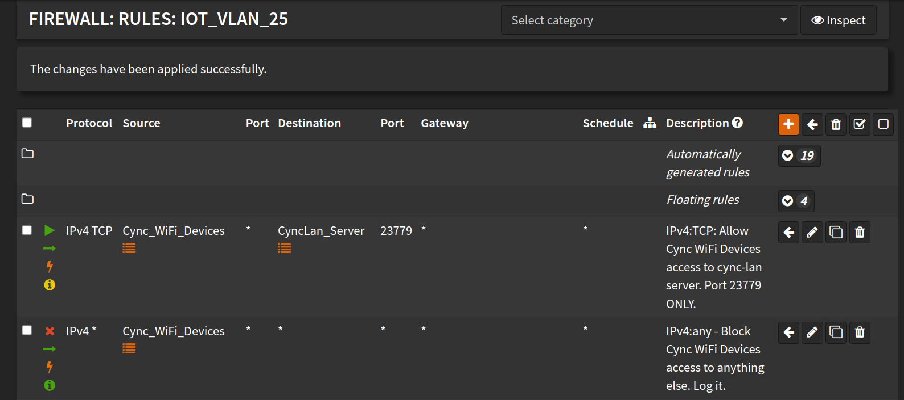

# Devices - never connect / unavailable / offline
If you followed the [DNS docs](./DNS.md) and the [Install docs](./install) and devices are still not connecting, 
you may need to check your network configuration (firewall, etc.). If the Cync devices are on a separate subnet, 
make sure that all Cync devices can talk to the local IP of the machine running `cync-lan`.

## OPNSense Firewall Example

# I can't add new devices in the Cync phone App! It always fails at the last step "Adding to Home"
**Disable the DNS redirect so your phone app / new device(s) can connect to**
**the cloud, power cycle the new device(s) after disabling DNS redirect**

After device(s) are added to your Cync account:
- [export](./cync-lan%20sub-commands.md#export) a new config
- re-enable the [DNS redirection](./DNS.md)
- restart the server
- power cycle the new device(s)
- **Optional:** *you may need to power cycle other Cync devices if the DNS redirection was disabled for a while*
