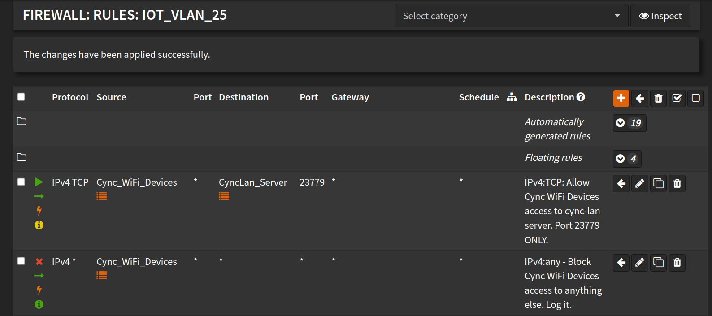

# Troubleshooting Guide

## Devices - Never Connect / Unavailable / Offline

If you followed the [DNS docs](./DNS.md) and the [Install docs](./install) and devices are still not connecting, you may need to check your network configuration (firewall, etc.). If the Cync devices are on a separate subnet, make sure that all Cync devices can talk to the local IP of the machine running `cync-controller`.

### OPNSense Firewall Example



## I Can't Add New Devices in the Cync Phone App

**Symptom:** Adding new devices always fails at the last step "Adding to Home"

**Solution:** Disable the DNS redirect so your phone app / new device(s) can connect to the cloud, power cycle the new device(s) after disabling DNS redirect

After device(s) are added to your Cync account:

- [export](./cync-controller%20sub-commands.md#export) a new config
- re-enable the [DNS redirection](./DNS.md)
- restart the server
- power cycle the new device(s)
- **Optional:** _you may need to power cycle other Cync devices if the DNS redirection was disabled for a while_

---

## Known Issues and Solutions

### Commands Don't Work / Lights Don't Turn On

**Symptoms:**

- Logs show commands sent, ACKs received, but physical devices don't respond
- GUI updates but lights don't physically turn on/off
- "Callback NOT found for msg ID: XX" in logs

**Root cause:** Missing `ControlMessageCallback` registration before sending command

**Fix:** Always register callback in `bridge_device.messages.control[msg_id]` before calling `bridge_device.write()`

**Example fix:**

```python
# BEFORE sending command:
m_cb = ControlMessageCallback(
    msg_id=cmsg_id,
    message=payload_bytes,
    sent_at=time.time(),
    callback=your_callback_coroutine,
    device_id=device.id,
)
bridge_device.messages.control[cmsg_id] = m_cb

# THEN send:
await bridge_device.write(payload_bytes)
```

### Commands Work Once, Then Fail / Need to Click Twice

**Symptoms:**

- First command after refresh doesn't work
- Need to toggle twice for commands to take effect
- Rapid clicking causes commands to stop working
- Works initially, then stops working after using "Refresh Device Status"

**Root cause:** Automatic `trigger_status_refresh()` after every ACK was causing cascading refreshes

**Fix:** Removed automatic refresh from ACK handler (`devices.py` lines 2501-2505). Manual refresh button still works.

### Devices Flicker Between Available/Unavailable

**Symptoms:**

- Device entities show as "unavailable" intermittently
- Availability status changes rapidly in GUI
- Commands still work but availability is inconsistent

**Root cause:** Unreliable `connected_to_mesh` byte in 0x83 packets causing immediate offline marking

**Fix:** Added `offline_count` threshold - devices only marked offline after 3 consecutive offline reports (`server.py` lines 530-544)

---

_For more troubleshooting information, see [AGENTS.md](../../AGENTS.md) in the repository root._
