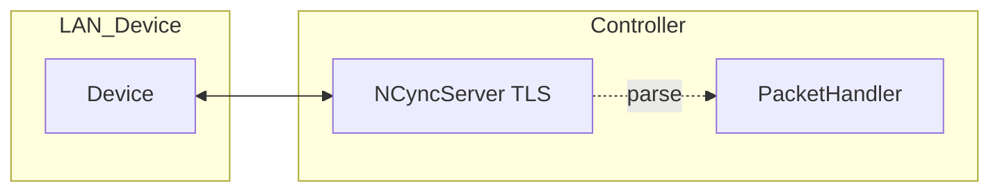

# Discovery Phase — Current TCP Communication Analysis

## Survey Results

### File Map

| File | Path | Description | Evidence |
|------|------|-------------|----------|
| TCP server accept | `cync_controller/server.py` | TLS TCP server accepting device connections; registers handler | `asyncio.start_server(self._register_new_connection, host, port, ssl)` |
| Forwarding/parsing | `cync_controller/server.py` | Reads from device stream, optional parse/log | `data = await source_reader.read(4096)` |
| Device stream IO | `cync_controller/devices/tcp_device.py` | Per-device read/write with locks, drain, perf timing | `raw_data = await self.reader.read(chunk)`; `await ... writer.drain()` |
| Packet parsing | `devices/tcp_packet_handler.py` | Parses headers, lengths, ids; handles ACKs | `pkt_type = packet_header[0]`; `await self.tcp_device.write(ack)` |
| Protocol inspector | `packet_parser.py` | Parses packet for logging | `packet_type = packet_bytes[0]` |
| Checksum | `packet_checksum.py` | 0x7E inner-struct checksum calculation | `sum ... modulo 256 between markers` |
| Correlation IDs | `correlation.py` | contextvars-based correlation | `ensure_correlation_id()` at entry points |
| Logging | `logging_abstraction.py` | JSON/human logging with correlation | `log_data['correlation_id'] = get_correlation_id()` |
| Perf timing | `instrumentation.py` | Decorators logging elapsed_ms vs threshold | `timed_async("relay_forward")` |

### Current Flow

## Identified Issues

### 1. Missing Per-Packet Correlation
- **Symptom**: Cannot trace individual toggle operations across send/recv
- **Root Cause**: Correlation ID set per-connection, not per-packet; `msg_id` from protocol not logged
- **Impact**: High MTTR when debugging failures; no audit trail
- **Evidence**: `ensure_correlation_id()` called at connection start only; logs don't contain packet-level IDs

### 2. No Idempotency/Deduplication
- **Symptom**: Risk of double-apply if network duplicates packets
- **Root Cause**: `msg_id` parsed from header but not used for deduplication
- **Impact**: Non-idempotent effects when retransmissions occur
- **Evidence**: `tcp_packet_handler.py` extracts `msg_id` but no LRU cache for dedup

### 3. Limited Retry/Backoff Semantics
- **Symptom**: Transient network issues surface as user-visible failures
- **Root Cause**: `writer.drain()` with fixed 2s timeout; no exponential backoff policy
- **Impact**: Unnecessarily high failure rate
- **Evidence**: `tcp_device.py` line 507: single timeout, no retry logic

### 4. No Backpressure Control
- **Symptom**: Buffer bloat and latency spikes under load
- **Root Cause**: Unbounded `read(4096)` loops; no bounded queues
- **Impact**: Memory pressure and unpredictable latency
- **Evidence**: `server.py` forwarding loops have no flow control

### 5. Missing Metrics
- **Symptom**: No visibility into packet success/failure rates, latency distributions
- **Root Cause**: No Prometheus instrumentation for TCP path
- **Impact**: Cannot set SLOs or alert on degradation
- **Evidence**: No `prometheus_client` imports in TCP layer

## Protocol Notes

### Packet Structure (Current Cync Protocol)
- **Header**: 12 bytes
  - Byte 0: Packet type (0x43, 0x73, 0x83, etc.)
  - Bytes 1-2: Unknown
  - Byte 3: Length multiplier (×256)
  - Byte 4: Base length
  - Bytes 5-9: Queue ID
  - Bytes 9-11: Message ID
- **Payload**: Variable, often wrapped in 0x7E markers
- **Checksum**: Sum of inner bytes modulo 256

### Known Packet Types
- 0x23: Handshake
- 0x43: Device info/broadcast status
- 0x73: Control/response
- 0x83: Status broadcast
- 0xA3: App announcement
- 0xD3: Heartbeat (device)

## Recommendations

1. **Phase 0**: Build isolated harness with per-packet IDs, metrics, JSON logs
2. **Phase 1**: Add framing, ACK/NACK, idempotency layer
3. **Phase 2**: Canary deployment with SLO monitoring
4. **Phase 3**: Full migration with rollback capability

## Open Questions

1. What exact opcode/framing does a real device expect for toggle?
2. Are there firmware versions with different protocol requirements?
3. What is the maximum safe packet rate per device?
4. Is TLS required for lab testing or can we defer?

## Next Steps

- Implement Phase 0 harness (see `01-phase-0.md`)
- Lab test with real device to validate assumptions
- Document actual protocol responses

