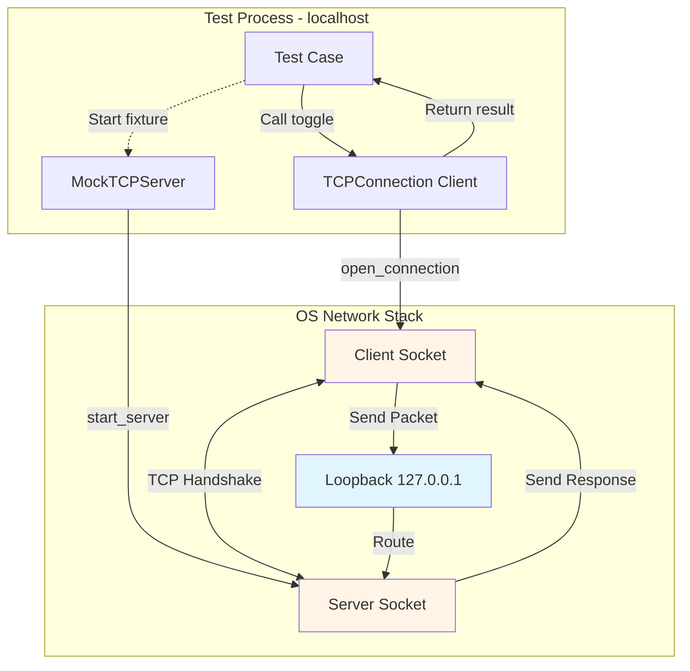
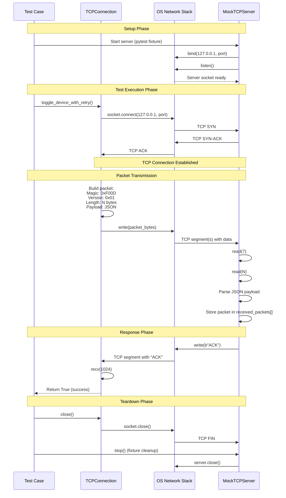
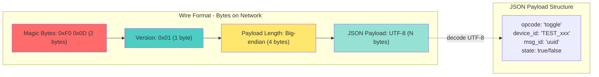
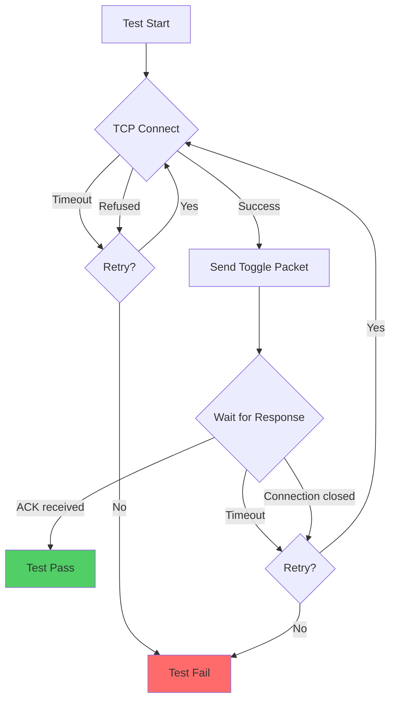
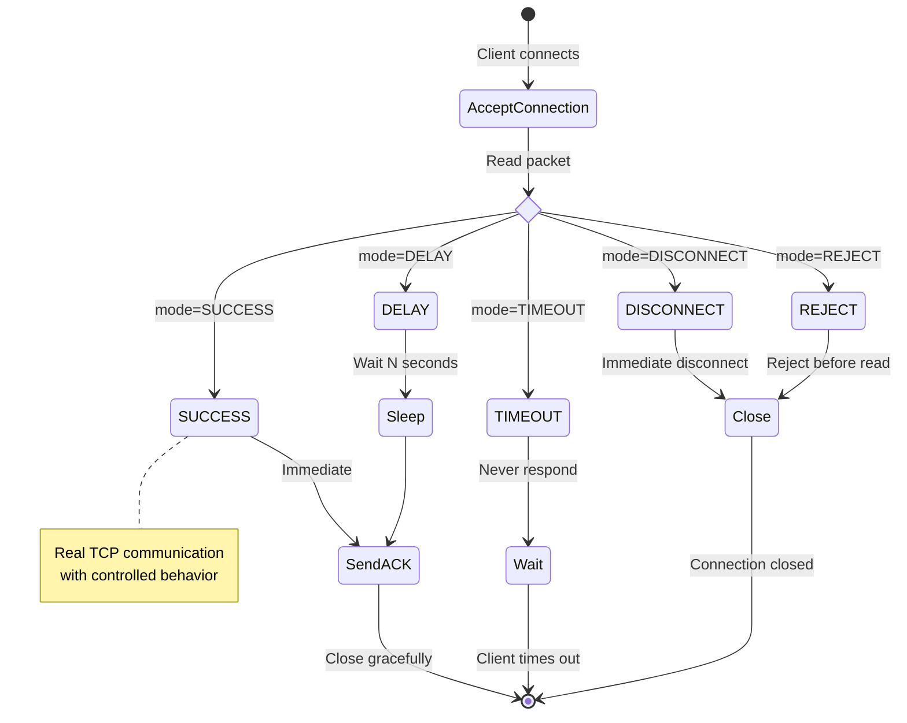

# Integration Test Network Communication Flow

This diagram illustrates the actual TCP network communication that occurs during the python-rebuild-tcp-comm integration tests.

## Network Architecture

## Sequence Diagram - Happy Path

## Packet Format

## Test Scenarios and Network Behavior

## MockTCPServer Response Modes

The MockTCPServer can simulate different network conditions:

## Key Characteristics

1. **Real TCP Sockets**: Uses actual OS network stack via `asyncio.open_connection()` and `asyncio.start_server()`
2. **Loopback Communication**: All traffic stays on `127.0.0.1` (localhost)
3. **Actual Packet Serialization**: Bytes are marshalled, sent over wire, and unmarshalled
4. **Real Network Errors**: Timeouts, connection refused, disconnections are genuine OS-level events
5. **Performance Measurement**: Latency includes actual TCP overhead, serialization, and OS scheduling
